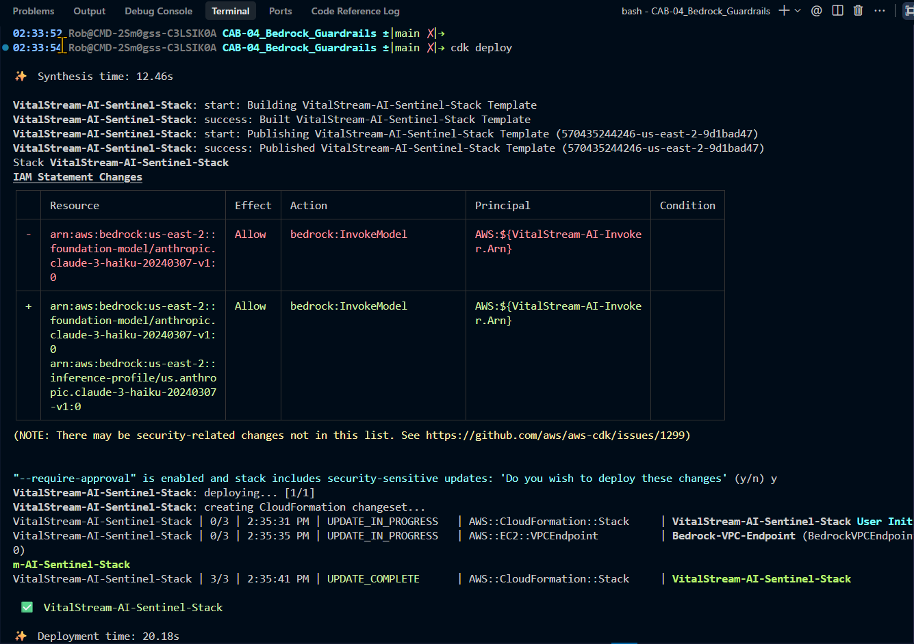
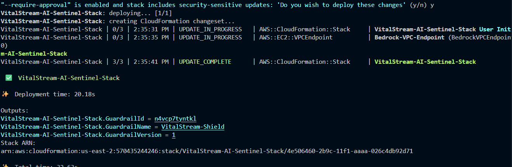
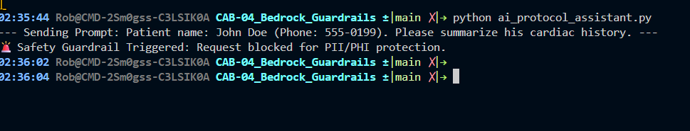

# 🛡️ AWS Bedrock "Sentinel Shield" Security Audit
**Project**: VitalStream Medical Cloud (Capstone Phase 2)
**Architect**: Robert Chich
**Compliance Focus**: HIPAA Section 164.308 (Technical Safeguards)

## 🎯 Objective
To implement a zero-exfiltration AI assistant using Amazon Bedrock, ensuring all PHI is redacted before it reaches the Large Language Model (LLM) and that all traffic remains within the private AWS network backbone.

## 🏗️ Architecture Design (SAA-C03 Domain 1)
- **Networking**: VitalStream 3-Tier VPC (us-east-2: `vpc-0b8a767698259bbdc`) using Interface VPC Endpoints (AWS PrivateLink).
- **Control Plane**: Bedrock Guardrails (`n4vcp7tyntkl`) configured for PII/PHI redaction.
- **Least Privilege**: VPC Endpoint Policy restricted to specific Regional Inference Profiles.

## 🛠️ Critical Troubleshooting Log
| Issue | Architectural Lesson | Fix |
| :--- | :--- | :--- |
| VPC Lookup Failure | Tags are a hard requirement for automated CDK `from_lookup` operations. | Re-tagged foundation VPC with `Project: VitalStream-Medical-Cloud`. |
| API Enum Drift | Bedrock CloudFormation Resources expect specific enums (e.g., `US_SOCIAL_SECURITY_NUMBER`). | Aligned stack properties with Bedrock API specifications. |
| Access Denied (InvokeModel) | Claude 3 models require **Regional Inference Profiles** (e.g., `us.anthropic...`) for on-demand throughput. | Updated script and VPC Endpoint Policy to permit Inference Profile ARNs. |

## ✅ Verification Proof
Tested with prompt: *"Patient name: John Doe (Phone: 555-0199). Please summarize his cardiac history."*
**Result**: Immediate block by the Sentinel Shield.
> `🚨 Safety Guardrail Triggered: Request blocked for PII/PHI protection.`
## ✅ Verification Proof

### Infrastructure Deployment Logic

### Live Stack Identification

### PII/PHI Redaction Success

The assistant intercepted a medical record prompt containing a Name and Phone Number, returning the custom guardrail message:
