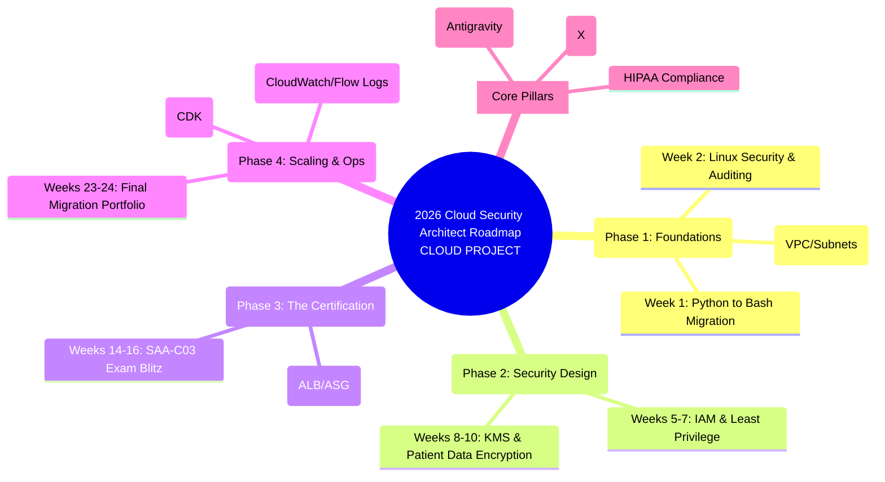

```mermaid
mindmap
  root((2026 Cloud Security Architect Roadmap<br/>CLOUD PROJECT))
    (Phase 1: Foundations)
      ::icon(fa fa-terminal)
      Week 1: Python to Bash Migration
      Week 2: Linux Security & Auditing
      Weeks 3-4: Networking Core (VPC/Subnets)
    (Phase 2: Security Design)
      ::icon(fa fa-shield-halved)
      Weeks 5-7: IAM & Least Privilege
      Weeks 8-10: KMS & Patient Data Encryption
    (Phase 3: The Certification)
      ::icon(fa fa-certificate)
      Weeks 11-13: High Availability (ALB/ASG)
      Weeks 14-16: SAA-C03 Exam Blitz
    (Phase 4: Scaling & Ops)
      ::icon(fa fa-code)
      Weeks 17-20: Infrastructure as Code (CDK)
      Weeks 21-22: Monitoring (CloudWatch/Flow Logs)
      Weeks 23-24: Final Migration Portfolio
    [Core Pillars]
      ::icon(fa fa-book)
      HIPAA Compliance
      Build in Public (X)
      AI Agent Supervision (Antigravity)
```