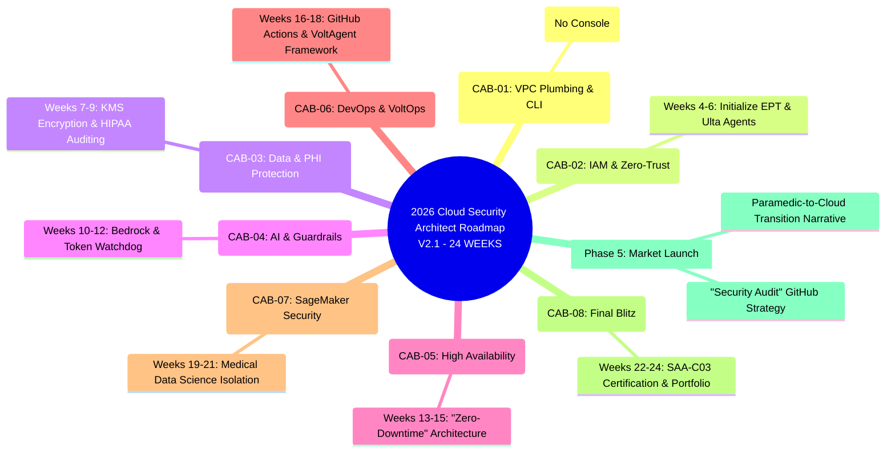

```mermaid
mindmap
  root((2026 Cloud Security Architect Roadmap<br/>V2.1 - 24 WEEKS))
    (CAB-01: VPC Plumbing & CLI)
      ::icon(fa fa-terminal)
      Weeks 1-3: 3-Tier VPC via Bash (No Console)
    (CAB-02: IAM & Zero-Trust)
      ::icon(fa fa-shield-halved)
      Weeks 4-6: Initialize EPT & Ulta Agents
    (CAB-03: Data & PHI Protection)
      ::icon(fa fa-lock)
      Weeks 7-9: KMS Encryption & HIPAA Auditing
    (CAB-04: AI & Guardrails)
      ::icon(fa fa-robot)
      Weeks 10-12: Bedrock & Token Watchdog
    (CAB-05: High Availability)
      ::icon(fa fa-server)
      Weeks 13-15: "Zero-Downtime" Architecture
    (CAB-06: DevOps & VoltOps)
      ::icon(fa fa-code-commit)
      Weeks 16-18: GitHub Actions & VoltAgent Framework
    (CAB-07: SageMaker Security)
      ::icon(fa fa-brain)
      Weeks 19-21: Medical Data Science Isolation
    (CAB-08: Final Blitz)
      ::icon(fa fa-certificate)
      Weeks 22-24: SAA-C03 Certification & Portfolio
    [Phase 5: Market Launch]
      ::icon(fa fa-rocket)
      Paramedic-to-Cloud Transition Narrative
      "Security Audit" GitHub Strategy
```