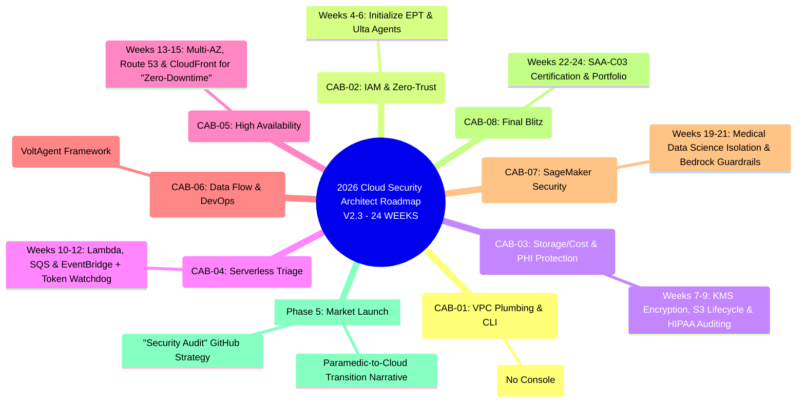

```mermaid
mindmap
  root((2026 Cloud Security Architect Roadmap<br/>V2.3 - 24 WEEKS))
    (CAB-01: VPC Plumbing & CLI)
      ::icon(fa fa-terminal)
      Weeks 1-3: 3-Tier VPC via Bash (No Console)
    (CAB-02: IAM & Zero-Trust)
      ::icon(fa fa-shield-halved)
      Weeks 4-6: Initialize EPT & Ulta Agents
    (CAB-03: Storage/Cost & PHI Protection)
      ::icon(fa fa-lock)
      Weeks 7-9: KMS Encryption, S3 Lifecycle & HIPAA Auditing
    (CAB-04: Serverless Triage)
      ::icon(fa fa-bolt)
      Weeks 10-12: Lambda, SQS & EventBridge + Token Watchdog
    (CAB-05: High Availability)
      ::icon(fa fa-server)
      Weeks 13-15: Multi-AZ, Route 53 & CloudFront for "Zero-Downtime"
    (CAB-06: Data Flow & DevOps)
      ::icon(fa fa-code-commit)
      Weeks 16-18: Kinesis, Glue ETL & GitHub Actions (VoltAgent Framework)
    (CAB-07: SageMaker Security)
      ::icon(fa fa-brain)
      Weeks 19-21: Medical Data Science Isolation & Bedrock Guardrails
    (CAB-08: Final Blitz)
      ::icon(fa fa-certificate)
      Weeks 22-24: SAA-C03 Certification & Portfolio
    [Phase 5: Market Launch]
      ::icon(fa fa-rocket)
      Paramedic-to-Cloud Transition Narrative
      "Security Audit" GitHub Strategy
```