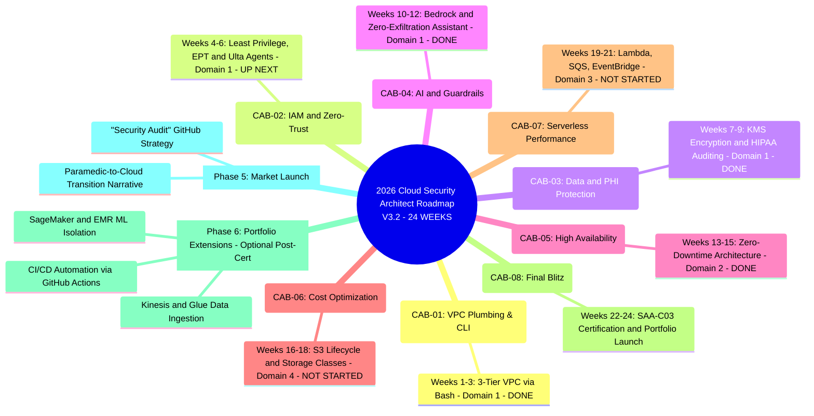

```mermaid
mindmap
  root((2026 Cloud Security Architect Roadmap<br/>V3.2 - 24 WEEKS))
    (CAB-01: VPC Plumbing & CLI)
      ::icon(fa fa-terminal)
      Weeks 1-3: 3-Tier VPC via Bash - Domain 1 - DONE
    (CAB-02: IAM and Zero-Trust)
      ::icon(fa fa-shield-halved)
      Weeks 4-6: Least Privilege, EPT and Ulta Agents - Domain 1 - UP NEXT
    (CAB-03: Data and PHI Protection)
      ::icon(fa fa-lock)
      Weeks 7-9: KMS Encryption and HIPAA Auditing - Domain 1 - DONE
    (CAB-04: AI and Guardrails)
      ::icon(fa fa-robot)
      Weeks 10-12: Bedrock and Zero-Exfiltration Assistant - Domain 1 - DONE
    (CAB-05: High Availability)
      ::icon(fa fa-server)
      Weeks 13-15: Zero-Downtime Architecture - Domain 2 - DONE
    (CAB-06: Cost Optimization)
      ::icon(fa fa-coins)
      Weeks 16-18: S3 Lifecycle and Storage Classes - Domain 4 - NOT STARTED
    (CAB-07: Serverless Performance)
      ::icon(fa fa-bolt)
      Weeks 19-21: Lambda, SQS, EventBridge - Domain 3 - NOT STARTED
    (CAB-08: Final Blitz)
      ::icon(fa fa-certificate)
      Weeks 22-24: SAA-C03 Certification and Portfolio Launch
    [Phase 6: Portfolio Extensions - Optional Post-Cert]
      ::icon(fa fa-puzzle-piece)
      CI/CD Automation via GitHub Actions
      Kinesis and Glue Data Ingestion
      SageMaker and EMR ML Isolation
    [Phase 5: Market Launch]
      ::icon(fa fa-rocket)
      Paramedic-to-Cloud Transition Narrative
      "Security Audit" GitHub Strategy
```