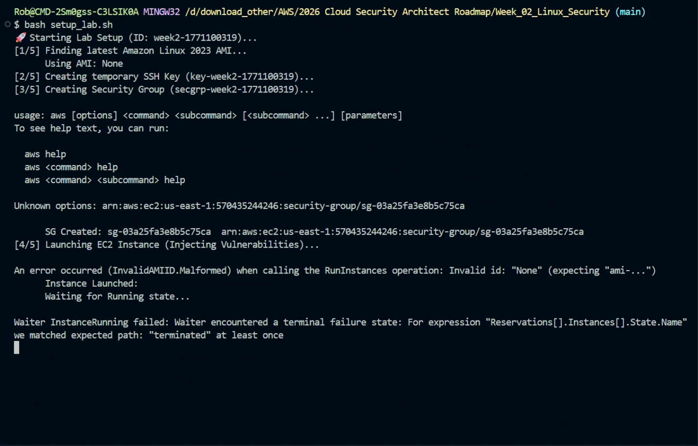

# 🐧 Week 2: Linux Security & Auditing
## Core Concept: The "Zero Trust" Operating System

---

# 🔑 Principle: Least Privilege in Linux

**The "Root" Problem**
*   Root (UID 0) has unlimited power.
*   If a hacker gets root, they own the entire hardware.
*   **Golden Rule:** Never log in as root. Use `sudo` (SuperUser Do) for specific commands.

---
# 🏃‍♂️Running the setup_lab.sh

---

---
# Slide Title 

* First key point of your presentation
* Second key point with more detail
* A third point to balance the slide


---
---
---
# Lab Troubleshooting: `setup_lab.sh`

* **Issue**: Script failed during EC2 instance launch.
* **Error**: `InvalidAMIID.Malformed` - the AMI ID was detected as "None".
* **Status**: Instance reached "terminated" state instead of "running".
* **Next Step**: Verify the `Finding latest Amazon Linux 2023 AMI` logic in the script.


---

---

**The Solution: RBAC (Role-Based Access Control)**
*   **User (u):** The owner of the file.
*   **Group (g):** A team of users sharing permissions.
*   **Others (o):** Everyone else (The World).

---

# 🛡️ File Permissions Decoded

Every file in Linux has a "Mode": `rwx`

*   **r (Read):** Can view contents.
*   **w (Write):** Can modify/delete.
*   **x (Execute):** Can run as a script/program.

**The Danger Zone:** `777` (rwxrwxrwx)
*   Scanning for files with `w` for "Others" is a critical security audit step.
*   *If `world` can write to your config file, they can inject malware.*

---

# 🔬 The Lab: `audit_system.sh`

We built a script to automate the "First Look" security check.

### What it does:
1.  **UID 0 Check:** Finds any user masquerading as root.
2.  **World-Writable Scan:** Searches `/etc/` for insecure configs.
3.  **Log Analysis:** Parsed `/var/log/auth.log` to potential brute-force attacks.

### How to Run:
```bash
chmod +x audit_system.sh
./audit_system.sh
```

---

# 📊 Architecture Visualization
*(See `diagram.mermaid` in this folder)*

The script acts as a "Watchdog" sitting between the User and the Kernel Logs.

> "In Cloud, the OS is just another layer. If the OS is weak, the VPC firewall doesn't matter." 
---

