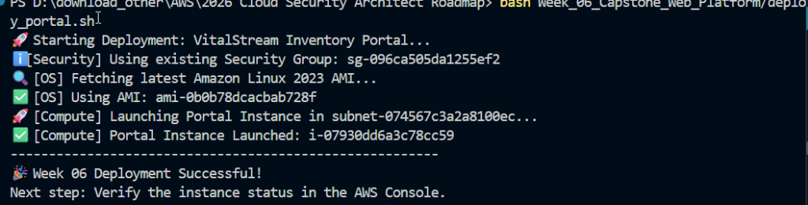
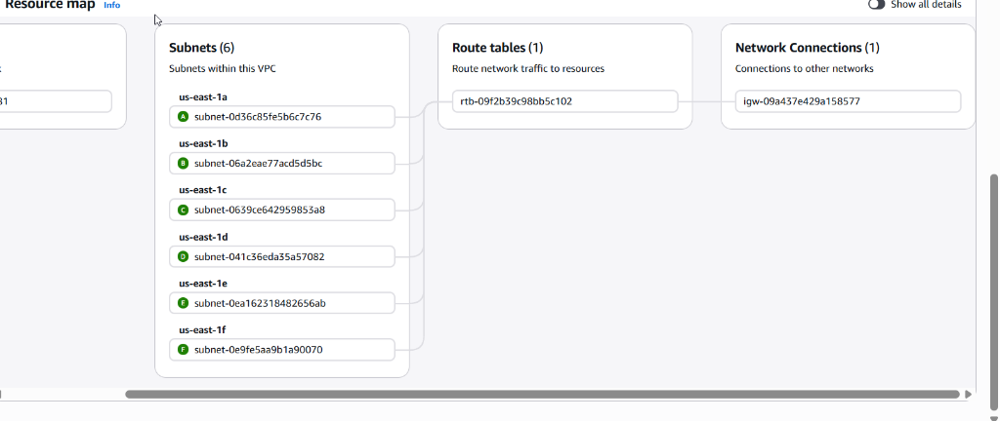
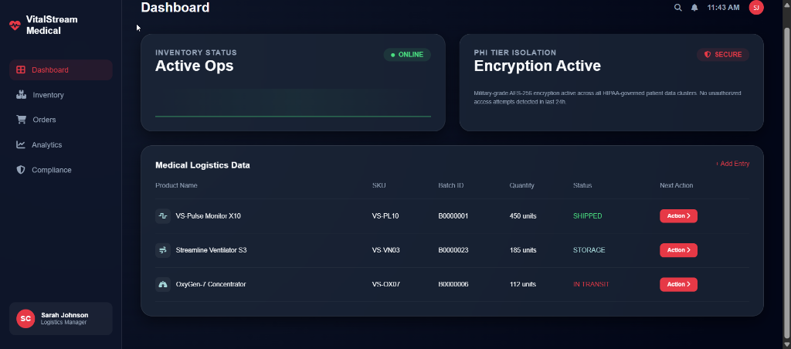

# 🛡️ Study Guide: Week 06 Capstone
## Sessions Recap: 1:00 PM - Present (2026-03-15)

**Lead Architect**: [Rob Chich](https://www.linkedin.com/in/robchich/)
**Objective**: Moving from Static Network to Functional, Professionally Branded Infrastructure.

---

# 🚀 Lesson 1: Automated Deployment Proof
**The Win**: Successfully launching a t3.micro instance into the private tier using a fully automated Bash script.

*Key Takeaway: Automation reduces human error in HIPAA-regulated environments.*

---

# 🎨 Lesson 2: Dynamic Branding with MARP
**Challenge**: How to maintain a consistent professional look across multiple slide decks without repeating CSS.

**The Solution**: Global Theme Centralization
- **Central Asset**: Created `assets/2smogss.css` as the "Single Source of Truth."
- **Aesthetic**: Night-sky radial gradients, "Vital Red" highlights, and Inter/Outfit typography.

---

# 🗺️ Lesson 3: VPC Visual Verification
**Security Audit**: Verifying that the Routing Tables and Subnet associations match our Zero-Trust architecture.

*Lesson: The Resource Map is your first line of defense in identifying misrouted traffic.*

---

# 🚀 Lesson 4: Robust Deployment Scripting
**Challenge**: SSM Parameter lookup returning `None`.
**The Fix**: Advanced Discovery Patterns with manual fallbacks to `describe-images`.

---

# 🌉 Lesson 5: The Bastion Host Bridge
**Challenge**: Auditing isolated private instances.
**The Solution**: The Administrative Airlock (Bastion) + Windows SSH Permission Fixes.

---

# 📊 Lesson 6: High-Fidelity Prototyping
**Final Result**: The professional VitalStream Medical Dashboard.

**Implementation Details**:
- **Glassmorphism**: `backdrop-filter: blur()` for premium feel.
- **Sideloading Content**: Injecting large-scale HTML via Bash `User Data`.

---

# 📍 Current Architecture State
1. **Public Edge**: 
   - Bastion Bridge (`i-014a0d66416dfc41b`)
   - 🚧 Demo Portal (`i-0044c51b570bd45e`) — *Temporary*
2. **Private App Tier**: 
   - Internal Portal (`i-07930dd6a3c78cc59`)
3. **Connectivity**: 
   - No NAT Gateway yet (Server isolation confirmed).

> "Architecture is not just what it looks like, it's how it stays standing under pressure."
