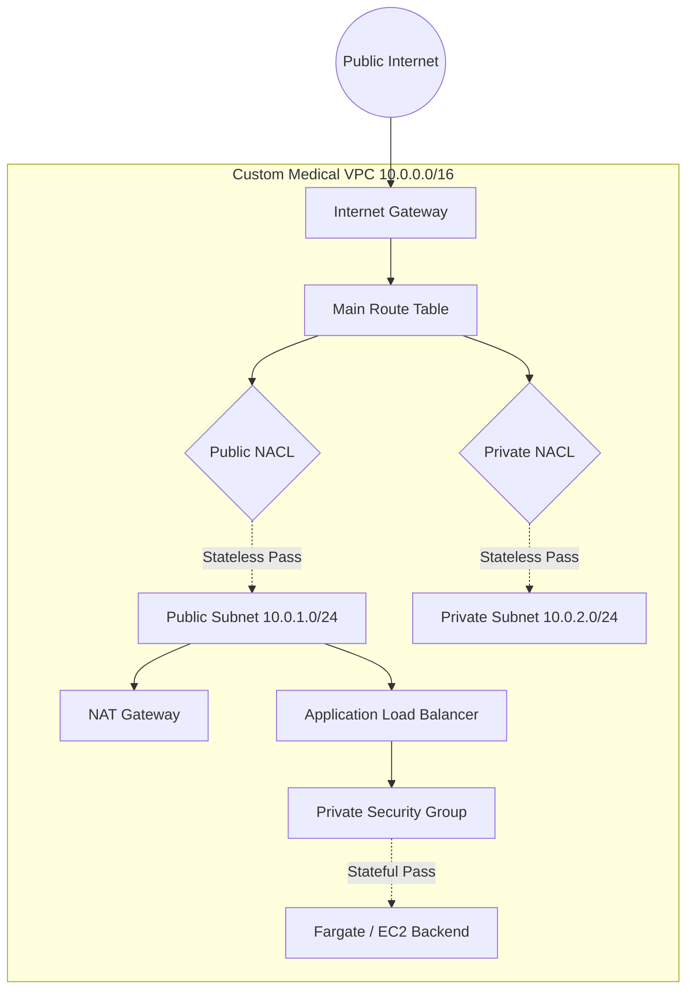

# VPC Packet Journey Implementation Plan

> **For Antigravity:** REQUIRED WORKFLOW: Use `.agent/workflows/execute-plan.md` to execute this plan in single-flow mode.

**Goal:** Build a highly visual MARP + Mermaid slide deck detailing a packet's journey through an AWS VPC, and formally integrate this study artifact into the 24-week syllabus.

**Architecture:** A standalone MARP markdown file containing sequence diagrams (Mermaid) representing stateless vs. stateful packet evaluation layers. 

**Tech Stack:** Markdown, MARP YAML, Mermaid.js

---

### Task 1: Initialize the Slide Deck & Big Picture Diagram

**Files:**
- Create: `learning_teach/VPC_Packet_Journey.md`

**Step 1: Write the Base Deck and Big Picture Mermaid Graph**
Append this exact content sequentially.

```markdown
---
marp: true
theme: default
class: default
paginate: true
---

# The Anatomy of a Zero-Trust Medical VPC
## The Packet's Journey
**Study Focus:** SAA-C03 / Cloud Architect Preparedness

---

# The Big Picture: Regional Boundary


```

**Step 2: Save and Verify**
Verify the file was created and Markdown syntax is complete. No failing tests applicable.

**Step 3: Commit**
```powershell
git add learning_teach/VPC_Packet_Journey.md
git commit -m "docs: init VPC packet journey slide deck and big picture"
```

---

### Task 2: Create The Inbound Journey Slides

**Files:**
- Modify: `learning_teach/VPC_Packet_Journey.md`

**Step 1: Append Inbound Analysis Slides**

```markdown
---

# The Inbound Journey: Perimeter Defense

**1. The Router (Internet Gateway):**
*   **Question:** Does this packet belong in my VPC CIDR block? 
*   **Action:** If yes, the Route Table directs it to the target subnet boundary.

**2. The Network ACL (NACL - Stateless):**
*   **Question:** Is this IP explicitly blocked at the subnet border?
*   **Action:** NACLs are *stateless*. They evaluate inbound rules first, and *return outbound* traffic must be explicitly allowed to leave. This is the subnet's bouncer.

**3. The Public Security Group (SG - Stateful):**
*   **Question:** Is this inbound traffic allowed by a rule (e.g., Port 443)?
*   **Action:** Security Groups are *stateful* and operate at the instance/ENI level. If traffic is allowed IN, the return traffic is automatically allowed OUT, regardless of outbound rules.

---

# The Chasm: Public to Private Transition

*   Your ALB handles SSL termination in the **Public Subnet**.
*   The raw HTTP/TCP traffic is then forwarded internally across the AZ boundary to the **Private Subnet**.
*   **The Private SG Rule:** The backend database or app container explicitly only accepts traffic *from the ID of the ALB's Security Group*. It drops everything else.
```

**Step 2: Commit**
```powershell
git add learning_teach/VPC_Packet_Journey.md
git commit -m "docs: add inbound evaluation layer slides"
```

---

### Task 3: Create Outbound Egress & Cheat Sheet Slides

**Files:**
- Modify: `learning_teach/VPC_Packet_Journey.md`

**Step 1: Append Egress & Summary Slides**

```markdown
---

# The Outbound Egress: Zero-Exfiltration

How does a private, isolated container securely download OS patches without exposing PHI?

**NAT Gateways vs. Egress-Only Internet Gateways:**
*   **NAT Gateway:** Resides in the Public Subnet. Translates the Private IP to its own Public IP, fetches the patch from the internet, and securely routes it back. 
*   **Egress-Only IGW:** Used strictly for IPv6.

**VPC Endpoints (AWS PrivateLink):**
*   Your container needs to pull a patient record from S3 or run inference against Amazon Bedrock. 
*   **The Trap:** Do not send that API call over the NAT Gateway to the public internet! 
*   **The Solution:** Provision a Gateway/Interface Endpoint. The traffic stays entirely on the AWS private backbone.

---

# SAA-C03 Cheat Sheet

| Feature | Security Groups | Network ACLs (NACL) |
| :--- | :--- | :--- |
| **Operates At** | Instance (ENI) Level | Subnet Level |
| **State** | **Stateful:** Return traffic auto-allowed | **Stateless:** Return traffic must be explicit |
| **Rules** | Supports **Allow** rules only | Supports **Allow** and **Deny** rules |
| **Evaluation** | All rules evaluated simultaneously | Evaluated strictly by rule number (lowest first) |
| **Default Context**| Denies all inbound, allows all outbound | Allows all inbound/outbound by default |

```

**Step 2: Commit**
```powershell
git add learning_teach/VPC_Packet_Journey.md
git commit -m "docs: finalize egress evaluation and SAA cheat sheet"
```

---

### Task 4: Integrate into Roadmap Syllabus

**Files:**
- Modify: `docs/roadmap-v3.2.md`

**Step 1: Add Syllabus Checkpoints**
Locate the `CAB-01: VPC Plumbing & CLI` section and inject:
```markdown
*   [ ] **Review Deck**: Study the "VPC Packet Journey" presentation to solidify stateful/stateless evaluation.
```

Locate the `Phase 8: SAA-C03 Certification Prep` section (or nearest Final Blitz section) and inject:
```markdown
*   [ ] **Presentation Rehearsal**: Export and review all "Architect Blueprint" slide decks from `learning_teach/`.
```

**Step 2: Commit**
```powershell
git add docs/roadmap-v3.2.md
git commit -m "docs: inject study method gates into roadmap v3.2"
```

---
