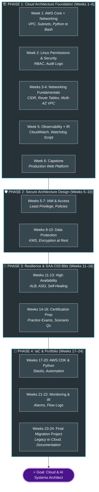

# Roadmap Visualization

```mermaid
graph TD
    %% Main Goal
    Goal([⭐ Goal: Cloud & AI Systems Architect])
    style Goal fill:#4a148c,stroke:#e1bee7,stroke-width:4px,color:#fff

    %% Phase 1
    subgraph Phase1 ["🏗️ PHASE 1: Cloud Architecture Foundation (Weeks 1–6)"]
        direction TB
        
        W1[Week 1: AWS Core + Networking<br/><i>VPC, Subnets, Python to Bash</i>]
        click W1 "./Week_01_Medical_VPC/README.md" "Open Week 1 Lab"
        W2[Week 2: Linux Permissions & Security<br/><i>RBAC, Audit Logs</i>]
        click W2 "./Week_02_Linux_Security/README.md" "Open Week 2 Lab"
        W3_4[Weeks 3-4: Networking Fundamentals<br/><i>CIDR, Route Tables, Multi-AZ VPC</i>]
        W5[Week 5: Observability + IR<br/><i>CloudWatch, Watchdog Script</i>]
        W6[Week 6: Capstone<br/><i>Production Web Platform</i>]
        
        W1 --> W2 --> W3_4 --> W5 --> W6
    end

    %% Phase 2
    subgraph Phase2 ["🛡️ PHASE 2: Secure Architecture Design (Weeks 5–10)"]
        direction TB
        W5_7[Weeks 5-7: IAM & Access<br/><i>Least Privilege, Policies</i>]
        W8_10[Weeks 8-10: Data Protection<br/><i>KMS, Encryption at Rest</i>]
        
        W5_7 --> W8_10
    end

    %% Phase 3
    subgraph Phase3 ["🤖 PHASE 3: Resilience & SAA-C03 Blitz (Weeks 11–16)"]
        direction TB
        W11_13[Weeks 11-13: High Availability<br/><i>ALB, ASG, Self-Healing</i>]
        W14_16[Weeks 14-16: Certification Prep<br/><i>Practice Exams, Scenario Qs</i>]
        
        W11_13 --> W14_16
    end

    %% Phase 4
    subgraph Phase4 ["🚀 PHASE 4: IaC & Portfolio (Weeks 17–24)"]
        direction TB
        W17_20[Weeks 17-20: AWS CDK & Python<br/><i>Stacks, Automation</i>]
        W21_22[Weeks 21-22: Monitoring & IR<br/><i>Alarms, Flow Logs</i>]
        W23_24[Weeks 23-24: Final Migration Project<br/><i>Legacy to Cloud, Documentation</i>]
        
        W17_20 --> W21_22 --> W23_24
    end

    %% Connections between Phases
    W6 --> W5_7
    W8_10 --> W11_13
    W14_16 --> W17_20
    W23_24 --> Goal

    %% Styling
    classDef default fill:#37474f,stroke:#cfd8dc,stroke-width:1px,color:#fff;
    classDef phase fill:#263238,stroke:#80deea,stroke-width:2px,color:#fff;
    class Phase1,Phase2,Phase3,Phase4 phase;
    
    %% Goal Styling (Override default)
    style Goal fill:#4a148c,stroke:#e1bee7,stroke-width:4px,color:#fff
```
